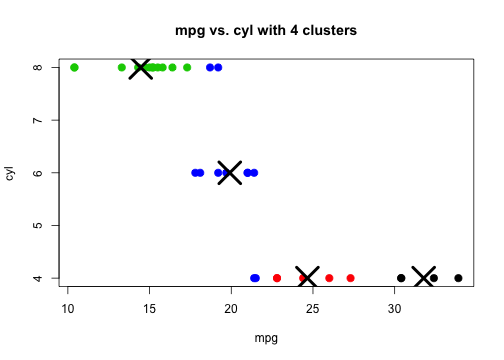

## Application description

The **shiny** application created for the Developing Data Products course project allows
users to explore a dataset and generate and visualize clusters from the data using the
[k-means](https://en.wikipedia.org/wiki/K-means_clustering) algorithm. 

The application is available online [here!](https://lattes.shinyapps.io/shiny-app/)

The dataset used in this case is the famous `mtcars` which is available in the `datasets`
package of base R.

The data was extracted from the 1974 Motor Trend US magazine, and comprises fuel consumption
and 10 aspects of automobile design and performance for 32 automobiles (1973–74 models).

---

## Dataset variables

The `mtcars` dataset consists of the following variables, which can be easily explored using
the **Shiny** app:

1. mpg	Miles/(US) gallon
2. cyl	Number of cylinders
3. disp	Displacement (cu.in.)
4. hp	Gross horsepower
5. drat	Rear axle ratio
6. wt	Weight (lb/1000)
7. qsec	1/4 mile time
8. carb	Number of carburetors
9. am	Transmission (0 = automatic, 1 = manual)
10. gear	Number of forward gears

---

## Exploring the data

The following is a preview of the `mtcars` dataset:


```r
data(mtcars)
head(mtcars)
```

```
##                    mpg cyl disp  hp drat    wt  qsec vs am gear carb
## Mazda RX4         21.0   6  160 110 3.90 2.620 16.46  0  1    4    4
## Mazda RX4 Wag     21.0   6  160 110 3.90 2.875 17.02  0  1    4    4
## Datsun 710        22.8   4  108  93 3.85 2.320 18.61  1  1    4    1
## Hornet 4 Drive    21.4   6  258 110 3.08 3.215 19.44  1  0    3    1
## Hornet Sportabout 18.7   8  360 175 3.15 3.440 17.02  0  0    3    2
## Valiant           18.1   6  225 105 2.76 3.460 20.22  1  0    3    1
```

By selecting two of those variables, say `mpg` and `cyl`, in the **control panel** of the **Shiny** application and a number of clusters, the data will be grouped using [k-means](https://en.wikipedia.org/wiki/K-means_clustering) and able to be visualized in the **Plots** tab in the right.

---

## Clustering plots

The plot that is generated by selecting `mpg` as *X* variable, `cyl` as *Y* variable and *4* clusters looks similar to this:



Each **X** in the plot represents the cluster centroid and each cluster has its own color for its points.

---

## Additional plots

In the **Plots** tab of the app, below the clustering plot, there are two plots that allow visualizing in a simple way the values that the selected variables *X* and *Y* can take.

Those figures are grouped using the `cyl` variable just for making graphics better.


```
##  4  6  8 
## 11  7 14
```

Since, as seen above, there are several cars with `4`, `6` or `8` cylinders, the two variable plots contain texts with the names of each car so they can be identifyable and matchable with a point in the cluster plot.
